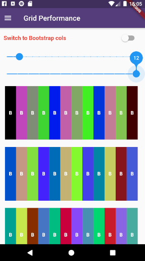
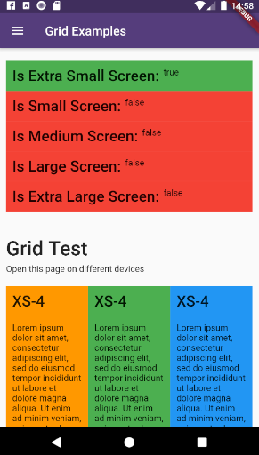
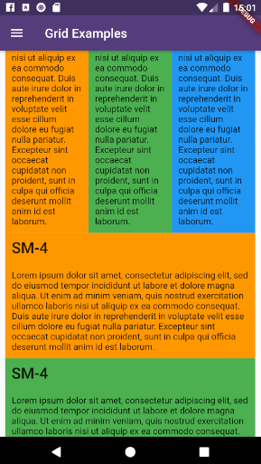
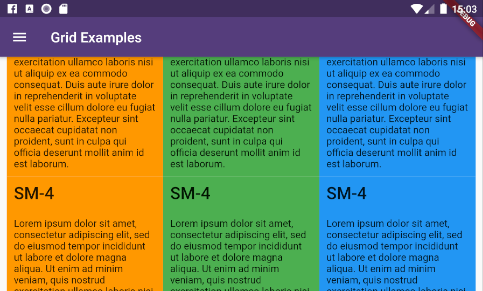

# About ```flutter_responsive``` plugin




This plugin provides a easy and productive way to work with responsive layouts for Flutter Applications in mobile, desktop and web, allowing your layout to adapt and wrap widgets ( Container, Rows, Columns and RichText ) referent to the size of his parent element.

Made by [Rafael Setragni](https://br.linkedin.com/in/rafael-setragni-55702823) to all Flutter's Community.

## Licensing

This project follows the GNU General Public License V3, wich means you can change the entire project the way as you want to, but you need to share your improvements back to the community.

To share your improvements, please first do a Fork of this project, change what you need to and finally do a pull request. And don´t let to share your ideas and needs on "Issues" page, even before to start your changes.


# IMPORTANT NOTES:

* This plugin was based on [Bootstrap Web Project](https://getbootstrap.com/), but do not implement all its features (not yet).
* The column responsivity is based on his closest parent widget size, not over the screen size, such as Bootstrap.
* All the widgets contains margin, padding, width, height (maximun and minimum edges), such as ```div``` Html element.
* Fell free to improve and change this project.


# How to Use

Add the dependency bellow into your ```pubspec.yaml``` file.

```yaml
dependencies:
  flutter_responsive: ^0.0.2
```
Add the reference into your ```.dart``` files
```dart
import 'package:flutter_responsive/flutter_responsive.dart';
```
Use the Widgets ```ResponsiveContainer```, ```ResponsiveRow```, ```ResponsiveCol``` and ```ResponsiveText``` as the way you want to.

## Screen Sizes

This plugin was based on Bootstrap web project and split the screen in 12 columns, considering 7 screen sizes:

* US - Ultra Small Screens - 0px to 309px
* XS - Extra Small Screens - 310px to 575px
* SM - Small Screens - 576px to 767px
* MD - Medium Screens - 768px to 991px 
* LG - Large Small Screens - 992px to 1199px
* XL - Extra Large Screens - 1200px to 1999px
* UL - Ultra Large Screens - 2000px and beyond







## Personalizing limits (Optional)

All the limits could be personalized as you need, changing the limit Hashmap into ResponsiveScreen class.

```dart
/* Map<String, double> */
ResponsiveScreen.limits = {
    'us': 0.00,
    // Smart watches
    'xs': 310.00,
    // Small phones (5c)
    'sm': 576.00,
    // Medium phones
    'md': 768.00,
    // Large phones (iPhone X)
    'lg': 992.00,
    // Tablets
    'xl': 1200.00,
    // Laptops
    'ul': 2000.00,
    // Desktops and TVs 4K
  };
```

## Grid Usage

This pluggin have 3 major grid elements:

* ResponsiveContainer: Container to all page elements, such as Rows and Columns, centralizing the content and beeing limited to a maximum width size
```dart
ResponsiveContainer(

  // Determines the container's limit size
  widthLimit: ResponsiveScreen.limits['lg'],
  margin: EdgeInsets.symmetric(horizontal: 10),
  
  children: <Widget>[
  
    ResponsiveRow(),
    ResponsiveRow(),
    ResponsiveRow(),
    
  ]
)
```

* ResponsiveRow: Container 
```dart
ResponsiveRow(

  margin: EdgeInsets.only(top: 20, bottom: 5),
  
  children: <Widget>[
    Text('Grid Offset Test', style: ResponsiveTypography.h2)
  ]
),
```

* ResponsiveCol:
```dart
ResponsiveCol(
  margin: EdgeInsets.all(10),
  padding: EdgeInsets.all(10),
  backgroundColor: Colors.blue,
  gridSizes: {
      'xs' : 4,
      'sm' : 3,
      'lg' : 2,
      'xl' : 1,
  },
  children: [
      Text('Lorem ipsum dolor sit amet, consectetur adipiscing elit')
  ]
)
```

## Full Example

```dart
import 'package:flutter/material.dart';
import 'package:flutter_responsive/flutter_responsive.dart';

class HomePage extends StatefulWidget {
  @override
  _HomePage createState() => _HomePage();
}

class _HomePage extends State<HomePage> {

  @override
  void initState() {
    super.initState();
  }

  @override
  Widget build(BuildContext context) {

    /*create 12 columns*/
    List<Widget> responsiveGridExample =

      /*repeat 12 times*/
      List<int>.generate(12, (index) => index).map((colIndex) =>
          ResponsiveCol(
              padding: EdgeInsets.all(10),
              backgroundColor: Colors.blue,
              gridSizes: {
                'xs' : 4,
                'sm' : 3,
                'lg' : 2,
                'xl' : 1,
              },
              children: [
                Text('Lorem ipsum dolor sit amet, consectetur adipiscing elit')
              ]
          )
      ).toList();

    MediaQueryData mediaQuery = MediaQuery.of(context);

    return Scaffold(
        appBar: AppBar(
          title: const Text('Home', overflow: TextOverflow.ellipsis),
        ),
        body: Container(
          color: Color(0xFFCCCCCC),
          child: ListView(
            children: <Widget>[
              ResponsiveContainer(
                margin: EdgeInsets.symmetric(vertical: 10),
                padding: EdgeInsets.symmetric(horizontal: 10),
                backgroundColor: Colors.white,
                widthLimit: mediaQuery.size.width * 0.95,
                children: <Widget>[
                  ResponsiveRow(
                    margin: EdgeInsets.symmetric(vertical: 10),
                    children: <Widget>[

                      ResponsiveCol(
                          padding: EdgeInsets.all(10),
                          margin: EdgeInsets.only(bottom: 20),
                          backgroundColor: Colors.blueGrey,
                          children: [
                            Text('Flutter Responsive Layout', style: ResponsiveTypography.h4.merge(TextStyle(color: Colors.white)))
                          ]
                      ),
                    ]
                  ),
                  ResponsiveRow(
                    margin: EdgeInsets.symmetric(vertical: 10),
                    children: <Widget>[

                      // By default, the column occupies the entire row, always
                      ResponsiveCol(
                        children: [
                          ResponsiveText(
                            shrinkToFit: true,
                            padding: EdgeInsets.only(bottom: 20),
                            stylesheet: {
                              'h3': ResponsiveStylesheet(
                                  textStyle: TextStyle(color: Theme.of(context).primaryColor),
                                  displayStyle: DisplayStyle.block
                              ),
                              'h6': ResponsiveStylesheet(
                                  textStyle: TextStyle(color: Theme.of(context).primaryColor),
                                  displayStyle: DisplayStyle.block
                              )
                            },
                            margin: EdgeInsets.symmetric(horizontal: 10, vertical: 20),
                            text:
                            '<div>'
                                '<h3>Responsive Layouts</h3><h6>for <i>Flutter</i></h6>'
                                '<br><br>'
                                '<p>This <b>RichText</b> was easily produced and personalized using pure HTML</p>'
                                '<p>Bellow there is an example of 12 columns, wich changes the amount of each line depending of his father´s widget size.</p>'
                            '</div>',
                          )
                        ]
                      )

                    ]..addAll(
                        responsiveGridExample
                    )
                  )
                ],
              )
            ],
          ),
        )
    );
  }
}
```

### Final result:


# How to run the pluggin example

This project is a starting point for a Flutter
[plug-in package](https://flutter.dev/developing-packages/),
a specialized package that includes platform-specific implementation code for
Android and/or iOS.

For help getting started with Flutter, view our 
[online documentation](https://flutter.dev/docs), which offers tutorials, 
samples, guidance on mobile development, and a full API reference.
